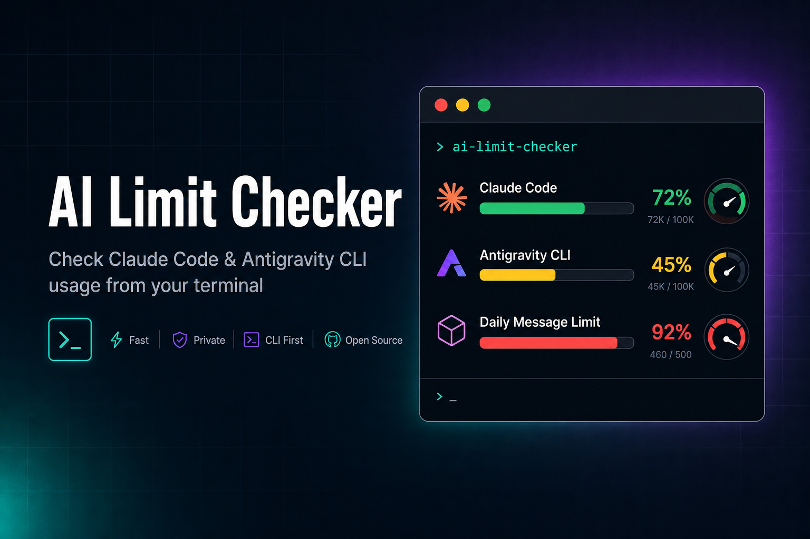

<div align="center">



# AI Limit Checker

**Check usage limits for Claude Code and Antigravity CLI from your terminal.**

[](https://pypi.org/project/ai-limit-checker/)
[](https://pypi.org/project/ai-limit-checker/)
[](https://opensource.org/licenses/MIT)
[](#testing)

</div>

---

## Contents

- [Features](#-features)
- [Install](#install)
- [Quick Start](#quick-start)
- [Watch Mode](#watch-mode)
- [JSON Output](#json-output)
- [Example Output](#example-output)
- [History](#history)
- [Recommendation](#recommendation)
- [MCP Server](#mcp-server)
- [How It Works](#how-it-works)
- [Auto Token Refresh](#auto-token-refresh)
- [Programmatic API](#programmatic-api)
- [CLI Reference](#cli-reference)
- [Development](#development)
- [License](#license)

## ✨ Features

- **Claude Code** — 5h & 7d usage windows with Sonnet/Opus breakdown
- **Antigravity CLI** — Per-group (Gemini / Claude+GPT) weekly + five-hour limits
- **Auto token refresh** — Both Claude and Antigravity OAuth tokens are automatically refreshed when expired (no more 401 errors)
- **Watch mode** — Automatically detect when a 5h limit resets and notify you
- **History** — View stored usage as a per-window timeseries to spot trends
- **Recommendation** — Get told which provider to use next based on current headroom
- **MCP server** — Query usage from AI agents over the Model Context Protocol
- **JSON output** — Structured output for AI agents (Hermes, Claude Code, etc.)
- **Zero dependencies** — Pure Python stdlib, no pip conflicts
- **Cross-platform** — Windows, macOS, and Linux
- **No credential leakage** — Tokens never printed; only official API endpoints are called

## Install

```bash
pip install ai-limit-checker
```

Requires Python 3.10+. No external dependencies.

## Quick Start

```bash
# Show all limits (default)
aichecker

# JSON output for AI agents / scripts
aichecker --json

# Compact one-liner (great for shell prompts / tmux status bars)
aichecker --oneline

# Check only one tool
aichecker --claude
aichecker --antigravity

# Ignore the 60s cache (force fresh API call)
aichecker --no-cache
```

Two command names are available — `aichecker` and `ailimits` — both invoke the same entry point.

## Watch Mode

Watch mode polls usage every 5 minutes and **automatically sends a ping** to the CLI when a **5h limit window resets** — triggering a fresh usage window so you can resume work immediately.

### CLI

```bash
# Run continuously (polls every 5 min, pings on reset)
aichecker --watch

# Single check — perfect for cron jobs
aichecker --watch --once

# Customise poll interval and post-reset delay
aichecker --watch --interval 60 --delay 30

# Dry-run — log what would happen without calling the CLIs
aichecker --watch --once --dry-run
```

**How it works:**

1. Every poll, the tool records each 5h window's `resets_at` timestamp and `used_pct`
2. When `now >= resets_at + delay` (default 120s) **and** the window had usage > 0% before, a reset is detected
3. A trivial prompt (`"hi"`) is sent to `claude -p` or `agy -p` to trigger a new 5h usage window
4. State is persisted to `~/.cache/ai-limit-checker/watch_state.json` across restarts

The 2-minute delay ensures the server has fully refreshed before triggering.

> **Deduplication:** if both Gemini and Claude/GPT groups on Antigravity reset at the same time, only one ping is sent to `agy` (they share the same 5h window on the same CLI).

### Cron setup

For scheduled use, run a single check with `--once`:

```bash
# crontab — every 5 minutes
*/5 * * * * /usr/local/bin/aichecker --watch --once
```

The tool stays silent when no reset has occurred (empty stdout = nothing to report).

### Programmatic API

```python
from ai_limit_checker.watch import watch_5h_resets

# Built-in: pings the CLI and prints to stdout on reset
watch_5h_resets(once=True)

# Custom callback — send to Discord, Telegram, Slack, etc.
# (the CLI ping still happens automatically; this is for extra notifications)
def on_reset(reset_labels: list[str]) -> None:
    msg = f"🔄 Limits reset: {', '.join(reset_labels)}"
    send_to_discord(msg)  # your notification function

watch_5h_resets(on_reset=on_reset, interval=300, delay=120, once=True)

# Dry-run mode — log without calling the CLIs (for testing)
watch_5h_resets(once=True, dry_run=True)
```

| Parameter   | Type             | Default | Description                                          |
| ----------- | ---------------- | ------- | --------------------------------------------------- |
| `on_reset`  | `Callable \| None` | `None`  | Callback receiving a list of reset window labels. If `None`, prints to stdout. The CLI ping happens regardless. |
| `interval`  | `int`            | `300`   | Seconds between polls (when not `--once`).           |
| `delay`     | `int`            | `120`   | Seconds to wait after `resets_at` before triggering. |
| `once`      | `bool`           | `False` | Run a single check and exit (for cron/scheduled use). |
| `dry_run`   | `bool`           | `False` | Log what would happen without calling the CLIs. |

## JSON Output

```bash
aichecker --json
```

Returns structured JSON with all limits, remaining percentages, and reset timestamps. AI agents can parse this to plan task delegation based on remaining quota.

<details>
<summary><b>Example JSON structure</b></summary>

```json
{
  "claude": {
    "status": "ok",
    "plan": "max",
    "five_hour": {
      "used_pct": 1.0,
      "remaining_pct": 99.0,
      "resets_at": "2026-06-29T16:31:00Z"
    },
    "seven_day": {
      "used_pct": 56.0,
      "remaining_pct": 44.0,
      "resets_at": "2026-07-02T05:00:00Z"
    }
  },
  "antigravity": {
    "status": "ok",
    "tier": "Google AI Ultra",
    "is_paid": true,
    "project_id": "my-project-12345",
    "groups": [
      {
        "name": "Gemini Models",
        "buckets": [
          {
            "window": "weekly",
            "label": "Weekly Limit",
            "used_pct": 0.0,
            "remaining_pct": 100.0,
            "remaining_fraction": 1.0,
            "resets_at": "2026-07-06T12:00:00Z"
          },
          {
            "window": "5h",
            "label": "Five Hour Limit",
            "used_pct": 0.0,
            "remaining_pct": 100.0,
            "remaining_fraction": 1.0,
            "resets_at": "2026-06-29T18:31:00Z"
          }
        ]
      },
      {
        "name": "Claude and GPT models",
        "buckets": [
          {
            "window": "weekly",
            "label": "Weekly Limit",
            "used_pct": 93.0,
            "remaining_pct": 7.0,
            "remaining_fraction": 0.07,
            "resets_at": "2026-07-02T12:00:00Z"
          },
          {
            "window": "5h",
            "label": "Five Hour Limit",
            "used_pct": 95.0,
            "remaining_pct": 5.0,
            "remaining_fraction": 0.05,
            "resets_at": "2026-06-29T12:50:00Z"
          }
        ]
      }
    ],
    "highest_used_pct": 95.0
  }
}
```

</details>

## Example Output

```
🔍 AI CLI Usage Checker
2026-06-29 12:00:00

════════════════════════════════════════
  Claude Code (Max Plan)
════════════════════════════════════════
  ✅ Connected
  5h Window:  1.0% used (99.0% left) → resets in 4h 56m
  7d Window:  56.0% used (44.0% left) → resets in 2d 17h

════════════════════════════════════════
  Antigravity CLI
════════════════════════════════════════
  ✅ Connected
  Tier: Google AI Ultra
  Project: my-project-12345

  Gemini Models
    Weekly Limit:       0.0% used → resets in 6d 23h
    Five Hour Limit:    0.0% used → resets in 4h 59m

  Claude and GPT models
    Weekly Limit:      93.0% used → resets in 2d 20h
    Five Hour Limit:   95.0% used → resets in 19m
```

One-liner mode (`--oneline`):

```
Claude: 1.0% (5h) ✅ | 56.0% (7d) ✅ | Antigravity: 95.0% used 🔴
```

Status icons are based on **% used**: `✅` under 70%, `⚠️` 70–90%, `🔴` 90–100%, `❌` at/over 100% or on error.

## History

Every `aichecker` run (and every `--burn-rate` call) appends a usage snapshot to a rolling per-window history stored at `~/.cache/ai-limit-checker/burn_rate.json` (last 50 samples per window). `--history` renders that series as a timeseries, so you can see how a limit has trended over time rather than just its current value.

```bash
# Show all windows
aichecker --history

# Filter to a single window
aichecker --history --window claude_five_hour

# Only snapshots from the last hour (also accepts 30m, 2d, or a raw unix timestamp)
aichecker --history --since 1h

# Clear stored history (optionally scoped with --window)
aichecker --history --clear
```

```
Claude 5h  (3 samples)
  2026-06-29 12:00  45.0% used
  2026-06-29 12:30  52.0% used  (+7.0)
  2026-06-29 13:00  58.0% used  (+6.0)
```

The value in parentheses is the change from the previous sample. History needs a few runs to build up — a single run records one sample per window. Add `--json` for the raw snapshot arrays.

## Recommendation

`--recommend` analyses current usage across both providers, computes a multi-factor score (0-100) for each, and recommends which to use next.

### Scoring Criteria

The 0-100 composite score is calculated using four weighted factors:
- `Severity (35%)`: Safe (100), Warning (50), Critical (15), Exhausted (0), Unknown (0)
- `Headroom (30%)`: Lowest remaining percentage across all limit windows
- `Reset Proximity (20%)`: How soon the worst window resets (imminent resets score higher to encourage waiting/resuming soon)
- `Burn Rate (15%)`: Real-time velocity from usage history (slower usage scores higher)

### Exclude Groups

By default, the `Claude and GPT models` group on Antigravity is excluded from analysis (since users usually have a separate direct Claude Code subscription). You can customize this or include all groups via the programmatic API or MCP server parameters.

```bash
aichecker --recommend
```

```
🎯 Recommendation: Switch to Antigravity

  Claude Code: ⚠️ warning (79.0% used, 5h bottleneck, resets in 2h 15m) — score: 52
      5h: ⚠️ warning (79.0% used, resets in 2h 15m)
      7d: ✅ safe (50.0% used, resets in 2d 9h)
  Antigravity: ✅ safe (7.5% used, Gemini weekly bottleneck, resets in 2d 14h) — score: 88
      Gemini Weekly Limit: ✅ safe (7.5% used, resets in 2d 14h)
      Gemini Five Hour Limit: ✅ safe (0.0% used, resets in 4h 59m)

Reason: Antigravity scores higher (88 vs 52). Claude is 36 points lower.
```

The recommendation is based on a score difference threshold: when scores are within 10 points it returns *either*, otherwise it suggests the clear winner. If both are exhausted or unavailable, it returns *none*. Add `--json` for the structured form (which contains a detailed `score_breakdown`).

## MCP Server

The package ships a zero-dependency [MCP](https://modelcontextprotocol.io) server (JSON-RPC over stdio), so AI agents (Claude Code, Hermes, etc.) can query usage directly instead of shelling out:

```bash
aichecker --mcp
```

It exposes four tools:

| Tool                 | Purpose                                                      |
| -------------------- | ----------------------------------------------------------- |
| `get_limits`         | Current usage for both tools (same data as `--json`)        |
| `get_burn_rate`      | Usage velocity and estimated time to each limit             |
| `get_history`        | Stored snapshot timeseries for trend analysis               |
| `get_recommendation` | Which provider to use next, with per-window bottleneck info |

## How It Works

The library query flow integrates automatic token refresh to ensure checks never fail on expired credentials.

### Claude Code

1. Reads OAuth credentials from `~/.claude/.credentials.json` (Windows/Linux) or macOS Keychain
2. Proactively refreshes the OAuth access token if it has expired or is about to expire, or reactively refreshes and retries the request once if an HTTP 401 error occurs
3. Calls the official Anthropic usage API to get 5h and 7d window data

### Antigravity CLI

1. Reads OAuth credentials from Windows Credential Manager (`gemini:antigravity`) or `~/.gemini/oauth_creds.json`
2. Obtains a valid access token, renewing it proactively if expired, or reactively refreshing and retrying the sequence if a call returns an HTTP 401 error
3. Calls `daily-cloudcode-pa.googleapis.com` — the same endpoint the Antigravity desktop app uses
4. Fetches tier info via `loadCodeAssist`, then per-model-group quota buckets

> **Why `daily-` prefix?** The base endpoint `cloudcode-pa.googleapis.com` always returns `remainingFraction: 1` (100% remaining) regardless of actual usage. The `daily-` prefixed host returns real-time usage data that matches the desktop app's "Weekly Limit" / "Five Hour Limit" readouts.

### Antigravity usage readouts

Usage is reported as **% used**, matching the Antigravity desktop app. Models are grouped (Gemini vs. Claude/GPT); within a group the weekly and five-hour windows are shared.

**Tier note:** `loadCodeAssist` returns two tiers. `currentTier` is the Cloud Code Assist *API* tier — always `free-tier` for consumer (non-GCP) accounts, regardless of any Google One AI subscription. `paidTier` carries the real subscription (e.g. *Google AI Ultra*) and only appears when one exists, so the tool prefers it. The raw API tier is still available as `api_tier_id` in `--json` output. Accounts with no Google One AI plan correctly show `Antigravity (free-tier)`.

**Why "Gemini Models" can sit at `0.0%`:** on a *Google AI Ultra* account the Gemini group is effectively unmetered — the server reports `remainingFraction` of exactly `1` no matter how much you use Gemini (verified against a run that consumed millions of Gemini tokens). Only the third-party group (*Claude and GPT*) is metered and moves. So a Gemini group stuck at `0.0% used` after heavy Antigravity use is expected, not a bug. Genuinely tiny usage (under 0.1%) is shown as `<0.1% used` to distinguish it from an untouched `0.0%` limit, and the raw `remaining_fraction` (0–1, full precision) is included per bucket in `--json` output.

## Auto Token Refresh

To prevent authentication errors (such as HTTP 401 Unauthorized), the library handles OAuth token renewal automatically for both tools:

### Claude Code
- *Proactive refresh*: If the access token's `expiresAt` timestamp (stored in milliseconds) is within 1 minute of expiring, a fresh access token is retrieved using the refresh token before making the usage API call.
- *Reactive refresh*: If the usage API call still returns an HTTP 401 error, the library automatically exchanges the refresh token for a new access token and retries the request once.
- *Token-only recovery*: If only a refresh token is present, the library proactively performs a refresh to obtain an access token before fetching usage data.

### Antigravity CLI
- *Proactive refresh*: The library checks `expiry_epoch` in the credentials and automatically retrieves a fresh access token if it is expired or close to expiration.
- *Reactive refresh / 401 retry*: If any API call (`loadCodeAssist` or `retrieveUserQuotaSummary`) returns an HTTP 401 error, the library will refresh the access token using the refresh token and retry the sequence once.
- *Credential discovery*: Client credentials (client ID and client secret) are auto-extracted from the `agy` binary at runtime (or retrieved from env vars) to perform the refresh.

## Supported Tools

| Tool             | Metrics                                                    |
| ---------------- | --------------------------------------------------------- |
| Claude Code      | 5h window, 7d window, Sonnet/Opus breakdown               |
| Antigravity CLI  | Per-group weekly + five-hour limits, % used, reset time   |

## Programmatic API

All functions are importable from `ai_limit_checker`:

```python
from ai_limit_checker import check_claude, check_antigravity

# Check Claude Code usage
claude_result = check_claude()
print(claude_result["five_hour"]["used_pct"])

# Check Antigravity usage
agy_result = check_antigravity()
for group in agy_result.get("groups", []):
    print(group["name"])
    for bucket in group["buckets"]:
        print(f"  {bucket['label']}: {bucket['used_pct']}% used")
```

```python
from ai_limit_checker.cli import gather, format_json, format_oneline

# Gather both tools at once (with 60s caching)
result = gather(do_claude=True, do_antigravity=True)
print(format_json(result))
```

## CLI Reference

```
aichecker [OPTIONS]

Options:
  --json              Output structured JSON
  --oneline           Output a compact one-liner
  --claude            Check only Claude Code
  --antigravity       Check only Antigravity CLI
  --no-cache          Ignore the 60s result cache
  --watch             Watch mode: poll and ping CLI on 5h limit reset
  --once              Watch mode: single check (for cron)
  --interval SECONDS  Watch mode: poll interval (default 300)
  --delay SECONDS     Watch mode: delay after reset before triggering (default 120)
  --dry-run           Watch mode: log without calling the CLIs
  --burn-rate         Show usage velocity and estimated time to each limit
  --history           Show stored usage history as a timeseries
  --window WINDOW     With --history: filter to a single window id
  --since DURATION    With --history: only snapshots within 30m/2h/1d or after an epoch
  --clear             With --history: clear stored history and exit
  --recommend         Recommend which provider to use next
  --mcp               Start as an MCP server (JSON-RPC over stdio)
  --version           Show version
  -h, --help          Show help
```

## Development

```bash
git clone https://github.com/peetwan/ai-limit-checker.git
cd ai-limit-checker

# Install in editable mode with test dependencies
pip install -e ".[test]"
# or: pip install -e . && pip install pytest ruff

# Run tests
pytest

# Lint
ruff check src/ tests/

# Run locally
python -m ai_limit_checker --json
```

### Testing

The test suite uses `pytest` with 169 tests covering:

- Credential parsing (Claude & Antigravity)
- API response parsing and normalization
- Output formatting (human, JSON, one-liner)
- Watch mode: reset detection, state persistence, CLI ping triggering, deduplication, dry-run
- Burn rate, history timeseries, and provider recommendation logic
- MCP server: protocol compliance, tool dispatch, and argument validation
- Edge cases: missing credentials, API errors, unmetered groups, zero-usage rounding

```bash
pytest          # run all tests
pytest -q       # quiet mode
pytest -k watch # run only watch-mode tests
```

## License

MIT © [Peet Chanut](https://github.com/peetwan)

## Links

- [PyPI](https://pypi.org/project/ai-limit-checker/)
- [GitHub](https://github.com/peetwan/ai-limit-checker)
- [Issue Tracker](https://github.com/peetwan/ai-limit-checker/issues)